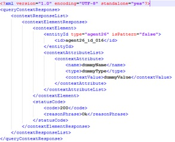

#  Aeron IoT Broker: non functional test guidelines #

Aeron is the FIWARE GE reference implementation of the IoT Broker Generic Enabler by NEC available at its [GitHub repository](https://github.com/Aeronbroker/Aeron). The description of the non functional tests carried out on this implementation is also published via the GitHub repository at [Fiware/test.NonFunctional/tests/aeron](../../../tests/aeron/aeron-test-cases.md)

## Expected results ##

These tests are intended to:

- monitor the behavior and **performance** of the API `updateContext` -namely a NGSI-10 operation which represents the push-mode interaction of this GE under a growing workload in order to find its **most production point**.
- assess the **stability** of the API `queryContext` -namely a NGSI-10 operation designed for the synchronous retrieval of data 
- monitor the behavior and **performance** of the API `subscribeContext` -namely a NGSI-10 operation which represents the asynchronous data retrieval interaction of this GEunder a growing workload.

More in detail, these tests involve the assessment of different non functional metrics such as:

1. Response times for <n> concurrent threads
2. Number of responses per second
3. Number of Bytes per second (Throughput)
4. HTTP response codes
5. Error rate
6. Maximum threads number handled
7. CPU usage
8. Memory usage
9. Network traffic

These values can be extracted, on the one hand from the output (CSV file) of the execution of the JMeter test plan file (*.jmx) and its log file (jmeter.log),  on the other hand from a tool for monitoring system resource usage such as [nmon](http://nmon.sourceforge.net/). 

## Testing environment ##
The testing environment can be easily set up through a FIWARE Lab, which is based on the cloud operating system OpenStack, and through which it is easy to create and configure a number of machines with the HW [requirements](http://fiware-iot-broker.readthedocs.io/en/latest/installadminguide/index.html#minimum-system-requirements)  needed by the GEri installation. Alternatively a different virtualisation system can be adopted as well as to prepare the overall hardware required, namely all the phisical machines needed for the test, which are:

1. A machine for the deployment of the GEri to be tested, **Aeron IoT Broker** server. Since this GEri, in order to work properly, rely on the GE **IoTDiscovery**, a mockup imlementation of the latter - available from the same owner- will be installed on the same machine.
2. A machine for **JMeter**, the tool used to inject load and for simulating the client and collecting the results generated by Aeron IoT Broker.
3. A machine for a server where to host a custom mock-up (WS application) named **iot-broker-tester** developed to simulate the missing actors needed by some test scenarios.
 
For example, in the latest test related to version 5.3 of the GEri, all the configured VMs in a dedicated FIWARE Lab were equipped with 2 CPU 2,3 GHz with 4GB RAM and 40 GB HD.

## Overall preliminary setup ##

Once the HW necessary for the test described previosly at "Testing Environmment" chapter has been setup, the following preliminary steps need to be accomplished before to start the test process:

> IoTBroker:

1. **Download** the source code of Aeron IoTBroker to the dedicated server through the command:
	`git clone --branch v5.3.3 https://github.com/Aeronbroker/Aeron.git --single-branch`
2. **Build** the component following the [GEri owner instructions](https://github.com/Aeronbroker/Aeron#building-iot-broker-source-code)
3. **Configure** Aeron IoTBroker following the [GEri owner istructions](https://github.com/Aeronbroker/Aeron#configure-the-iot-broker-with-setup-scripts).
4. **Start** the component with the script in the IoTBroker-runner folder

> IoTDiscovery:

5. **Download** the source code of NEConfman IoT Discovery to the dedicated server through the command:
	`git clone --branch v5.3.3 https://github.com/Aeronbroker/NEConfMan.git --single-branch`
6.  **Build** the component following the [GEri owner instructions](https://github.com/Aeronbroker/NEConfMan#compilation-procedure)
7.   **Configure** NEConfman IoTDiscovery following the [GEri owner istructions](https://github.com/Aeronbroker/NEConfMan#configure-the-nec-confman-with-setup-scripts).
8.   **Start** the component with the script in the ConfMan_Runner folder

> JMeter:

5. **Download** [JMeter binaries](https://jmeter.apache.org/download_jmeter.cgi) 3.0 and install it into JMeter dedicated server.

> iot-broker-tester:
> 
> This component is needed for testing scenario 1 (Update Context) and scenario 2 (Query Context) as described by the [test cases documentation ](../../../tests/aeron/aeron-test-cases.md); in the former it plays the role of the Data Consumer which receives the update messages; on the latter it plays the role of Data Provider -of which the component IoTDiscovery must be made aware- which simulates a number of agents able to answer with dummy data (but contextual to each request) to the incoming queries. 

1. **Download** the code&guidelines from the [GitHub repository](../../../testers/aeron/fiware-iotbroker-tester) and go to the folder `testers/aeron/fiware-iotbroker-tester`.
2. **Compile** the code of this component through the command `mvn package` (Maven and Java must have been previously installed). An uber-JAR (jar with all dependencies) named `iotbroker-tester-x.x.x.jar`  (where x.x.x is the current version) will be created in the sub-folder `target`.
3. **Copy** the jar file `iotbroker-tester-x.x.x.jar` created at the previous step to any folder of the dedicated server for this component.
4. **Run** the java application iotbroker-tester **when required** at the proper step through the command line related to the test being carried out.

## Test execution: updateContext performance test##

###Testing step by step###

1. **Download** the JMeter plan file [`[iotbroker-updates-200t-in-1800s.jmx]`](../../../scripts/aeron/scenarios/1-update/iotbroker-updates-200t-in-1800s.jmx) and **edit** it with JMeter application or any text editor and change the value of the **`HOST` parameter** with the current address of IoTBroker server.
2. **Place** the JMeter plan file in any folder of the **JMeter server** henceforth referenced as `<updateContext-test-path>`.
3. Open a shell on IoTBroker server and **start the `nmon` utility** using the command `nmon -f -s2 -c1800 -f`. This will collect 1800x2 samples of measurements about HW resource usage, one every two seconds, which corresponds to 1 h, namely for a period a bit longer than the JMeter test execution (40'); this is necessary in order to keep monitored for a while the resources even once the test has ended.  An output file having extension `.nmon` will be created and updated along the time till the end of the test.
4. Open a shell on IotBroker-tester server and **start** the aforementioned **mockup application** using the command:

		java –jar iotbroker-tester-1.0.5.jar data-consumer
which opens the port 8070 waiting for NGSI-10 UpdateContextRequest (from IoTBroker) and it gives back a message like the following:

	

5. Open a shell on JMeter server and **start the test** using the command `<jmeter-path>/jmeter.sh -n -t <updateContext-test-path>/iotbroker-updates-200t-in-1800s.jmx`
6. **Retrieve the results** of JMeter session test once it has ended. They consists mainly of two files:
	1. that one resulted from JMeter execution placed in the same execution folder and named as following: `update_yyyy-MM-dd HHmmss.csv`
	2. that one generated by nmon named as following:
	` <iotbroker-server-name>_yyMMdd_hhmm.nmon`

## Test execution: queryContext stability test##

###Preliminary setup###
For this test the IoTDiscovery component must be made aware of the agents (simulated by the aforementioned mock-up application) from which the IoTBroker needs related information (entity context). Hence, before to issue a `queryContext` message, several NGSI-9 `registerContext` messages must be sent to the IoTDiscovery. These prepared messages are available at this  [repository](../../../testers/aeron/fiware-iotbroker-tester/data-to-load-queryContext) and they consist essentially of bash shell scripts based o the `curl` command, one for each agent.
The number of scripts to be run (and thus the nr of NGSI-9 messages to be sent) depend on the number of agents needed for the test. For this test 20 agents are expected to be registered.
Before to run each script, the tags `<iotbroker-tester>` and `<iotdiscovery>` must be replaced with the ip addresses of related servers.

		E.g. ./registerContext_Agent01.sh

###Testing step by step###

1. Download the file [`[iotbroker-query-5T-50s-8h.jmx]`](../../../scripts/aeron/scenarios/2-query/iotbroker-query-5T-50s-8h.jmx) and edit it with JMeter application or any text editor and change the value of the `HOST` parameter with the current address of IoTBroker server.
2. Place the file downloaded and modified at the previous point somewhere into the JMeter server henceforth referenced as `<queryContext-test-path>`.
3. Open a shell on IoTBroker server and start the `nmon` utility using the command `nmon -f -s2 -c10800 -f`. This tool will collect 10800x2 samples of measurements about HW resource usage, one every two seconds, which corresponds to 6 h, namely for a period a bit longer than the JMeter test execution (5 h); this is necessary in order to keep monitored for a while the resources even once the test has ended.  An output file having extension `.nmon` will be created and updated along the time till the end of the test.
4. Open a shell on IotBroker-tester server and start the mockup application using the command:

		java –jar iotbroker-tester-1.0.5.jar data-provider 20
which opens 20 ports (simulating as many agents) from 8071 to 8090 waiting for a NGSI-10 queryContextRequest (from IoTBroker) and each of them is able to answer back a message like the following:

	

5. Open a shell on JMeter server and start the test using the command `<jmeter-path>/jmeter.sh -n -t <queryContext-test-path>/iotbroker-query-5T-50s-8h.jmx`
6. Retrieve the results of JMeter session test once it has ended. They consists mainly of two files:
	1. that one resulted from JMeter execution placed in the same execution folder and named as following: `query_yyyy-MM-dd HHmmss.csv`
	2. that one generated by nmon named as following:
	` <iotbroker-server-name>_yyMMdd_hhmm.nmon`

## Test execution: subscribeContext performance test##

###Preliminary setup###

###Testing step by step###

1. Download the file [`[iotbroker-subscriptions-200t-in-1800s.jmx]`](../../../scripts/aeron/scenarios/3-subscription/iotbroker-subscriptions-200t-in-1800s.jmx) and edit it with JMeter application or any text editor and change the value of the `HOST` parameter with the current address of the IoTBroker server.
2. Place the file downloaded and modified at the previous point somewhere into the JMeter server henceforth referenced as `<subscribeContext-test-path>`.
3. Open a shell on IoTBroker server and start the `nmon` utility using the command `nmon -f -s2 -c1800 -f`. This will collect 1800x2 samples of measurements about HW resource usage, one every two seconds, which corresponds to 1 hour, namely for a period a bit longer than the JMeter test execution (40'); this is necessary in order to keep monitored for a while the resources even once the test has ended.  An output file having extension `.nmon` will be created and updated along the time till the end of the test.
4. Open a shell on JMeter server and start the test using the command `<jmeter-path>/jmeter.sh -n -t <subscribeContext-test-path>/iotbroker-subscriptions-200t-in-1800s.jmx`
5. Retrieve the results of JMeter session test once it has ended. They consists mainly of two files:
	1. that one resulted from JMeter execution placed in the same execution folder and named as following: `subscription_yyyy-MM-dd HHmmss.csv`
	2. that one generated by nmon named as following:
	` <iotbroker-server-name>_yyMMdd_hhmm.nmon`