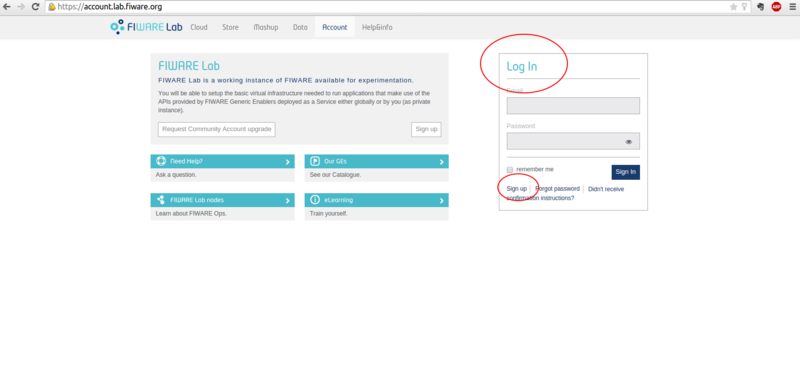
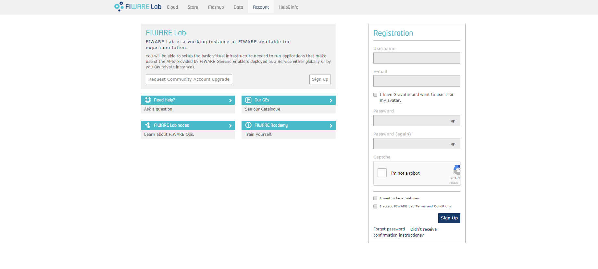

#  IdM Keyrock: non functional test guidelines #

Keyrock by UPM (Universidad Politécnica de Madrid) is the FIWARE reference implementation of IdM Generic Enabler and it is available at its [GitHub repository](https://github.com/ging/fiware-idm). The description of the non functional tests carried out on this implementation is also published via the GitHub repository at [Fiware/test.NonFunctional](https://github.com/fiware/test.NonFunctional/)

## Testing environment ##
The testing HW can be easily set up through a FIWARE Lab, which is based on the cloud operating system OpenStack, and through which it is easy to create and configure a number of machines with the environment [requirements](https://forge.fiware.org/plugins/mediawiki/wiki/fiware/index.php/Identity_Management_-_KeyRock_-_Installation_and_Administration_Guide#Requirements)  needed by the GEri installation. Alternatively a different virtualisation system can be adopted as well as to prepare the overall hardware required, namely all the phisical machines needed for the test, which are:

1. A machine for the deployment of the GEri IdM Keyrock and [nmon](http://nmon.sourceforge.net/) utility.
2. A machine for [JMeter](https://jmeter.apache.org/) ver 3.0, the tool used to inject load and for simulating the client and collecting the results generated by Keyrock.

 
For example, in the latest test related to version 5.3 of the GEri, all the configured VMs in a dedicated FIWARE Lab were equipped with 2 CPU 2,4 GHz with 4GB RAM and 40 GB HD.

## Overall preliminary setup ##

Once the needed environment previously described has been setup, the following preliminary steps need to be accomplished before to start the test process:

1. Build and install Keyrock as described in [GEri owner instructions](https://github.com/ging/fiware-idm#how-to-build-install)
2. Using a web browser, open the KeyRock portal (http://`<keyrock-hostname>`:8000) (see Figure 1)
3. Press `Sign up` button in order to create a new user (see Figure 2)
4. Complete the user registration.
 
**Figure 1.**

**Figure 2.**

## Test execution - User authentication##

###Preliminary setup###
In the file `keystone-authenticate-user-50thread-1800sec.jmx` apply the following changes:

1. Set the value related to the argument `HOST` with keyrock host name or IP address value. It's easy to find the exact point where to apply the change by searching the string `#keyrock hostname or IP#` and replacing it with the appropriate value.
2. Set a valid username and a password (e.g: that one created during the user registration of preliminary setup) in the HTTP payload which is contained by the parameter `HTTPArgument`; these two values can be easily set into this parameter by searching the strings `#username#` and `#password#` and replacing them with the appropriate values. 

###Testing step by step###

1. Put the file `keystone-authenticate-user-50thread-1800sec.jmx` in a generic working directory of the JMeter server.
2. In order to collect system CPU, memory and network information for 300 times each 10 seconds (3.000 seconds), start `nmon` utility in the KeyRock server through the command `nmon -s10 -c300 -f`. An output file with  `.nmon` extension will be created.
3. From a shell opened on JMeter server, start the test using the command `<jmeter absolute path>/jmeter.sh -n -t<working directory absolute path>/keystone-authenticate-user-50thread-1800sec.jmx`.  The output file `keystone-authenticate-user-50thread-1800sec.csv` will be created in the current directory.  
4. Collect the result files once the JMeter sessions has finished (30 minutes).

### Expected results ###

This test is intended to monitor the behavior of authentication API `/v3/auth/tokens` with a growing input workload and with a stable input workload.

More in detail, this test involves the assessment of different non functional metrics such as:

1. Response times for <n> concurrent threads
2. Number of responses per second
3. Number of Bytes per second (Throughput)
4. HTTP response codes
5. Error rate
6. Maximum threads number handled
7. CPU usage
8. Memory usage
9. Network traffic

These values can be extracted, on the one hand from the output (CSV file `keystone-authenticate-user-50thread-1800sec.csv`) of the execution of the JMeter test plan file (`keystone-authenticate-user-50thread-1800sec.jmx`), on the other hand from a tool for monitoring system resource usage such as [nmon](http://nmon.sourceforge.net/).

## Test execution - Check roles assignment##

###Preliminary setup###
To execute this test a valid token related to an existent user is nedeed, so, the following preliminary steps need to be accomplished before to start the test process:

1. Modify the following command line
	`curl #keyrock#:5000/v3/auth/tokens -v --command POST --header 'Content-Type: application/json' --data '{"auth": {"identity": {"methods": ["password"],"password": {"user": {"name": "#username#", "domain": { "id": "default" },"password": "#password#"}}}}}'`
	
	replacing:
	- strings `#username#` and `#password#` with valid values (es: username and password used in the registration phase of preliminary setup).
	- string `#keyrock#` with keyrock host name or IP address.
	
	Then execute it.

2. Get from response header the value of parameter `X-Subject-Token`. Here an example response:  
    HTTP/1.1 201 Created  
    X-Subject-Token: **bf16f6b8cf7b4183b5fe0e8b56479679**  
    Vary: X-Auth-Token  
    Content-Type: application/json  
    Content-Length: 1054  
    Date: Wed, 21 Sep 2016 11:03:37 GMT

3. In the file `keystone-check-user-roles-50thread-1800sec.jmx` apply the following changes:
	- Set the value related to the argument `HOST` with keyrock host name or IP address value. It's easy to find the exact point where to apply the change by searching the string `#keyrock hostname or IP#` and replacing it with the appropriate value.  
	- Set the value related to the parameter `X-Auth-Token` with `X-Subject-Token` value. It's easy to find the exact point where to apply the change by searching the string `#token#` and replacing it with the `X-Subject-Token` value.    

###Testing step by step###

1. Put the file `keystone-check-user-roles-50thread-1800sec.jmx` in a generic working directory of the user authenticated to the JMeter serve.
2. In order to collect system CPU, memory and network information for 300 times each 10 seconds (3.000 seconds), start `nmon` utility in the KeyRock server through the command `nmon -s10 -c300 -f`. An output file with  `.nmon` extension will be created.
3. From a shell opened on JMeter server, start the test using the command `<jmeter absolute path>/jmeter.sh -n -t<working directory absolute path>/keystone-check-user-roles-50thread-1800sec.jmx`.  The output file `keystone-check-user-roles-50thread-1800sec.csv` will be created in the current directory. 
4. Collect the result files once the JMeter sessions has finished (30 minutes).

### Expected results ###

This test is intended to monitor the behavior of authentication API `/v3/role_assignments` with a growing input workload and with a stable input workload.

More in detail, this test involve the assessment of different non functional metrics such as:

1. Response times for <n> concurrent threads
2. Number of responses per second
3. Number of Bytes per second (Throughput)
4. HTTP response codes
5. Error rate
6. Maximum threads number handled
7. CPU usage
8. Memory usage
9. Network traffic

These values can be extracted, on the one hand from the output (CSV file `keystone-check-user-roles-50thread-1800sec.csv`) of the execution of the JMeter test plan file (`keystone-check-user-roles-50thread-1800sec.jmx`), on the other hand from a tool for monitoring system resource usage such as [nmon](http://nmon.sourceforge.net/).  

## Test execution - Get projects assignment##

###Preliminary setup###
To execute this test a valid token related to an existent user is nedeed, so, the following preliminary steps need to be accomplished before to start the test process:

1. Modify the following command line
	`curl #keyrock#:5000/v3/auth/tokens -v --command POST --header 'Content-Type: application/json' --data '{"auth": {"identity": {"methods": ["password"],"password": {"user": {"name": "#username#", "domain": { "id": "default" },"password": "#password#"}}}}}'`
	
	replacing:
	- strings `#username#` and `#password#` with valid values (es: username and password used in the registration phase of preliminary setup).
	- string `#keyrock#` with keyrock host name or IP address.
	
	Then execute it.

2. Get from response header the value of parameter `X-Subject-Token`. Here an example response:  
    HTTP/1.1 201 Created  
    X-Subject-Token: **bf16f6b8cf7b4183b5fe0e8b56479679**  
    Vary: X-Auth-Token  
    Content-Type: application/json  
    Content-Length: 1054  
    Date: Wed, 21 Sep 2016 11:03:37 GMT

3. In the file `keystone-get-projects-50threads-1800sec.jmx` apply the following changes:
	- Set the value related to the argument `HOST` with keyrock host name or IP address value. It's easy to find the exact point where to apply the change by searching the string `#keyrock hostname or IP#` and replacing it with the appropriate value.  
	- Set the value related to the parameter `X-Auth-Token` with `X-Subject-Token` value. It's easy to find the exact point where to apply the change by searching the string `#token#` and replacing it with the `X-Subject-Token` value.    

###Testing step by step###

1. Put the file `keystone-get-projects-50threads-1800sec.jmx` in a generic working directory of the user authenticated to the JMeter server.
2. In order to collect system CPU, memory and network information for 300 times each 10 seconds (3.000 seconds), start `nmon` utility in the KeyRock server through the command `nmon -s10 -c300 -f`. An output file with  `.nmon` extension will be created.
3. From a shell opened on JMeter server, start the test using the command `<jmeter absolute path>/jmeter.sh -n -t<working directory absolute path>/keystone-get-projects-50threads-1800sec.jmx`.  The output file `keystone-get-projects-50threads-1800sec.csv` will be created in the current directory. 
4. Collect the result files once the JMeter sessions has finished (30 minutes).

### Expected results ###

This test is intended to monitor the behavior of authentication API `/v3/projects` with a growing input workload and with a stable input workload.

More in detail, this test involves the assessment of different non functional metrics such as:

1. Response times for <n> concurrent threads
2. Number of responses per second
3. Number of Bytes per second (Throughput)
4. HTTP response codes
5. Error rate
6. Maximum threads number handled
7. CPU usage
8. Memory usage
9. Network traffic

These values can be extracted, on the one hand from the output (CSV file `keystone-get-projects-50threads-1800sec.csv`) of the execution of the JMeter test plan file (`keystone-get-projects-50threads-1800sec.jmx`), on the other hand from a tool for monitoring system resource usage such as [nmon](http://nmon.sourceforge.net/).  

## Test execution - Check roles assignment (stability test)##

###Preliminary setup###
To execute this test a valid token related to an existent user is nedeed, so, the following preliminary steps need to be accomplished before to start the test process:

1. Modify the following command line
	`curl #keyrock#:5000/v3/auth/tokens -v --command POST --header 'Content-Type: application/json' --data '{"auth": {"identity": {"methods": ["password"],"password": {"user": {"name": "#username#", "domain": { "id": "default" },"password": "#password#"}}}}}'`
	
	replacing:
	- strings `#username#` and `#password#` with valid values (es: username and password used in the registration phase of preliminary setup).
	- string `#keyrock#` with keyrock host name or IP address.
	
	Then execute it.

2. Get from response header the value of parameter `X-Subject-Token`. Here an example response:  
    HTTP/1.1 201 Created  
    X-Subject-Token: **bf16f6b8cf7b4183b5fe0e8b56479679**  
    Vary: X-Auth-Token  
    Content-Type: application/json  
    Content-Length: 1054  
    Date: Wed, 21 Sep 2016 11:03:37 GMT

3. In the file `keystone-check-user-roles-10thread-28800sec.jmx` apply the following changes:
	- Set the value related to the argument `HOST` with keyrock host name or IP address value. It's easy to find the exact point where to apply the change by searching the string `#keyrock hostname or IP#` and replacing it with the appropriate value.  
	- Set the value related to the parameter `X-Auth-Token` with `X-Subject-Token` value. It's easy to find the exact point where to apply the change by searching the string `#token#` and replacing it with the `X-Subject-Token` value.    

###Testing step by step###

1. Put the file `keystone-check-user-roles-10thread-28800sec.jmx` in a generic working directory of the user authenticated to the JMeter server.
2. In order to collect system CPU, memory and network information for 300 times each 10 seconds (30.000 seconds), start `nmon` utility in the KeyRock server through the command `nmon -s10 -c3000 -f`. An output file with  `.nmon` extension will be created.
3. From a shell opened on JMeter server, start the test using the command `<jmeter absolute path>/jmeter.sh -n -t<working directory absolute path>/keystone-check-user-roles-10thread-28800sec.jmx`.  The output file `keystone-check-user-roles-10thread-28800sec.csv` will be created in the current directory. 
4. Collect the result files once the JMeter sessions has finished (8 h).

### Expected results ###

This test is intended to monitor the behavior of authentication API `/v3/role_assignments` with a stable input workload over a long period of time.

More in detail, this test involves the assessment of different non functional metrics such as:

1. Response times for <n> concurrent threads
2. Number of responses per second
3. Number of Bytes per second (Throughput)
4. HTTP response codes
5. Error rate
6. Maximum threads number handled
7. CPU usage
8. Memory usage
9. Network traffic

These values can be extracted, on the one hand from the output (CSV file `keystone-check-user-roles-10thread-28800sec.csv`) of the execution of the JMeter test plan file (`keystone-check-user-roles-10thread-28800sec.jmx`), on the other hand from a tool for monitoring system resource usage such as [nmon](http://nmon.sourceforge.net/). 