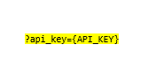

# APInf/API Umbrella: test cases description #

The scenarios defined for stress and stability testing are taken as example of a request to a registered API.

- `API Request Stress`
- `API Request Stability` 

## Test Case 1. – API Request Stress ##

The goal of this scenario is to assess system performance with a high load in a short period of time. Previously, we've registered a custom API in API Umbrella, this registration gives us an API key (used as User Defined Variable for the test). In this test, we do requests to the API Umbrella doing reference to the registered final custom API.

Only one type of request is done in this script. "/local/prueba.html" is our endpoint to the custom API.
This path must be configured in the step of JMeter pointing to the registered API for each user.

Respect the load, we add one thread every 2 seconds until reach 300 users. The test is running a total of 25 minutes.

|ID	| GE API method	| Operation	| Type	| Payload	| Max. Concurrent Threads |
|---|:--------------|:----------|:------|:----------|:------------------------|
| 1 | /local/prueba.html  |  Request to API	| GET	|  | 300 |

Regarding the variables

- **api_key**: Key obtained when custom API is registered in API Umbrella. This key is necessary to do requests to the custom API through API Umbrella.

## Test Case 2. – API Request Stability ##

It's analogous to the test case 1. The only difference is the load for the execution. In this case we run 1 thread every 9 seconds until reach 20 users. Finally, the total duration of test is 6 hours.