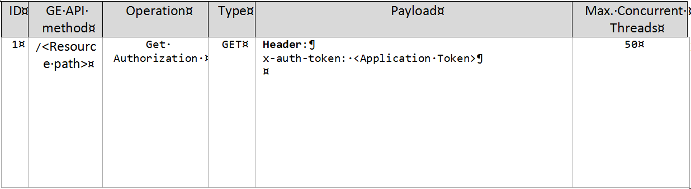

# Integrated Wilma, AuthZForce, Keyrock: test cases description #

The purpose of this document is to present the results of a performance test carried out on three integrated Generic Enablers: IdM, PEP Proxy and PDP, more specifically their reference implementation named, respectively, KeyRock, Wilma and AuthZForce. For the preparation of these test, the most used methods to access a configured IdM/PDP application resource have been taken into account;  in fact the test involved the `resource access` API to have access to protected REST services.

The picture below, that is taken from the GE official documentation, shows how KeyRock, Wilma and AuthZForce GEs can be used in FIWARE, and how it fits in the FIWARE architecture.

##Policy decision point test case ##

This test aims to stress the `resource access` API in order to evaluate authorization related to a given access request; therefore a valid `access token` (already configured in AuthZForce) is needed to complete this operation.

The main actors involved by this scenario, which are among those showed previously in the general structure of the FIWARE GE, are:

- `Access Requester`
- `PEP Proxy GE`
- `IdM GE`
- `PDP GE`
- `Protected REST Service`

The actor `Access Requester` is represented by the **JMeter** application installed on a server and configured to send a `rosource access` request to **Wilma**.

Actors `PEP Proxy GE`, `IdM GE` and `PDP GE` are represented by **Wilma**, **Keyrock** and **AuthZForce** modules installed on three different servers and in charge of fulfilling the aforementioned request.

The actor `Protected REST Service` is represented by the **Apache** application installed on a dedicated server and configured to receive a `REST` request from **Wilma**.

Some main steps can be identified in this test, which are:

1. JMeter sends a `resource access` request.
2. Wilma receives and sends a first `authorization request` to Keyrock.
3. Keyrock once verified the incoming request sends a positive (HTTP code 200) or negative response (HTTP code 401) to Wilma as the case.
4. In case of positive response by Keyrock, Wilma sends a second `authorization request` to AuthZForce.
5. Keyrock once verified the incoming request sends a positive (HTTP code 200) or negative response (HTTP code 401) to Wilma as the case.
6. In case of positive response by AuthZForce, Wilma sends the configured `REST`request to Apache and provides to JMeter the Apache response.

In order to guarantee the execution of each previous listed steps for each test ripetition, the caching system must be disabled on Wilma.
 
For this test JMeter has to be configured with a growing number threads (max 50) which continuosly solicit the `resource access` API for a period of 30 minutes.

An example of the payload contained by these requests can be found in the table below:

