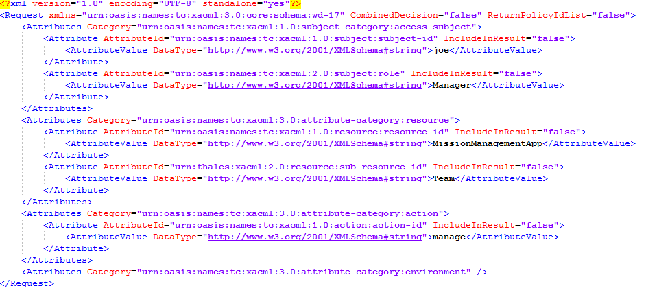

# AuthZForce: test cases description #

The scenarios defined for stress testing are taken from the most used operations of AuthZForce, which correspond to the API methods that generate the next actions:

- `Create Domain`
- `Delete Domain` 
- `Authorization Request`

## Test Case 1.- Stress Scenario 1 – Create and Delete Domain ##

The goal of this scenario is to assess system performance with a high load in a short period of time, creating a domain, and deleting it.

In the involved dataflow, as depicted by the picture above, are expected 2 main actors which are played respectively by the hosts shown in the following table:

| Actor | SW Involved | VM Host | Role |
|-------|:------------|:--------|:-----|
| AuthZForce Administrator | JMeter | Tester machine | Injects load to the component |
| AuthZForce component | AuthZForce and Tomcat | Hosting machine 1 | Subject of the test |

There are two types of requests in this script. The first one creates a domain and, after that, the domain is deleted. We add one thread every five seconds to reach 200 and the scenario’s duration is 25 minutes

|ID	| GE API method	| Operation	| Type	| Payload	| Max. Concurrent Threads |
|---|:--------------|:----------|:------|:----------|:------------------------|
| 1 |	/authzforce-ce/domains |  Create domain	| POST	|  | 200 |
| 2 |	/authzforce-ce/domains/${NewDomain} | Delete domain | DELETE |  | 200 |

Regarding the variables

- **NewDomain**: The domain created and the one who is going to be deleted.

## Test Case 2.- Stress Scenario 2 – Authorization Decision ##

Stress scenario, adding a thread every six seconds to reach 200, sending an authorization decision request. 

As depicted by the picture above, 2 main actors are expected, which are played respectively by the hosts shown in the following table:

| Actor | SW Involved | VM Host | Role |
|-------|:------------|:--------|:-----|
| AuthZForce Authorization Requester | JMeter | Tester machine | Injects load to the component |
| AuthZForce component | AuthZForce and Tomcat | Hosting machine 1 | Subject of the test |

|ID	| GE API method	| Operation	| Type	| Payload	| Max. Concurrent Threads |
|---|:--------------|:----------|:------|:----------|:------------------------|
| 1 |	/authzforce-ce/domains/${DOMAIN_NAME}/pdp |  Authorization Decision	| POST	|  | 200 |

Regarding the variables

- **DOMAIN_NAME**: The domain the request is asked for. Must be created before the test.

## Test Case 3.- Stability Scenario ##

The goal of this scenario is to check if the system is degraded with a moderate load for a long period of time. This case is analogous to test case 2, but with the difference that it's a stability test, and not a stress one.

The test adds one thread every ten seconds to reach 20 and lasts 6 hours. 

Actors and requests are the same than in the first test case so it's not needed to explain them again.

