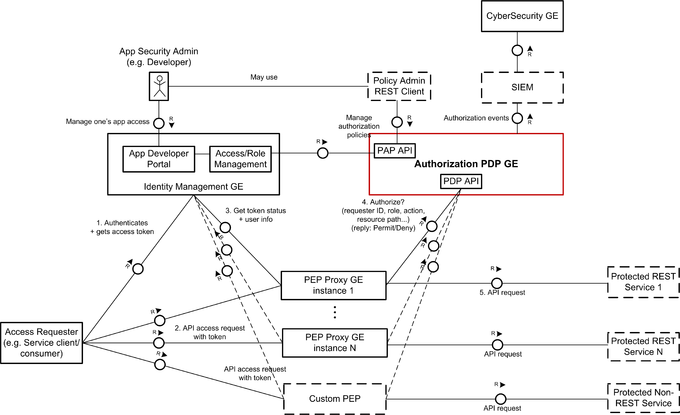
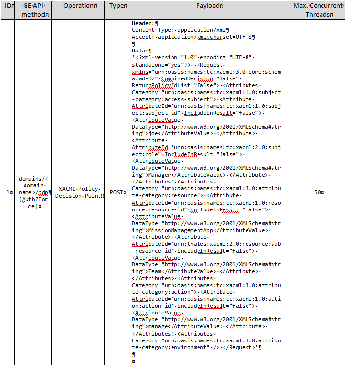

# AuthZForce: test cases description #

The scenarios defined for stress testing are taken from one of the most used AuthZForce operation such as the `Authorization Policy Decision evaluation`.

The picture below, originated by the GE official documentation, shows how the Authorization PDP GE can be used in FIWARE, and how it fits with the FIWARE architecture.

##Policy decision point performance test case ##

This test aims to stress the authorization API in order to evaluate performance of authorization decisions based on XACML policies and attributes related to a given access request; therefore a valid `domain ID` (already configured in AuthZForce) is needed to complete this operation.

The main actors involved by this scenario, which are among those showed previously in the general structure of the FIWARE GE, are:

- `PEP Proxy GE`
- `PDP GE - Authorization`

The actor `PEP Proxy GE` is represented by the **JMeter** application installed on a server and configured to send `policy decision point` requests to **AuthZForce** (an example of this type of request is shown in the table below).

The actor `PDP GE - Authorization` which is the **AuthZForce** module in charge of fulfilling the aforementioned requests.

Three main steps can be identified in this test, which are:

1. JMeter sends a `policy decision point` request.
2. AuthZForce receives and verifies the authorization request.
3. AuthZForce once verified the incoming request sends a positive (HTTP code 200) or negative response (HTTP code 401) to JMeter as the case. 

For this test JMeter has to be configured with a growing number threads (max 150) which continuosly solicit the AuthZForce authorisation API for a period of 30 minutes.

An example of the payload contained by these requests can be found in the table below:

##Policy decision point stability test case##

This test aims to assess the stability over a long period of the authorization decisions based on XACML policies and attributes related to a given access request; therefore a valid `domain ID` (already configured in AuthZForce) is needed to complete this operation.

The main actors involved by this scenario, which are among those showed previously in the general structure of the FIWARE GE, are:

- `PEP Proxy GE`
- `PDP GE - Authorization`

The actor `PEP Proxy GE` is represented by the **JMeter** application installed on a server and configured to send `policy decision point` requests to **AuthZForce** (an example of this type of request is shown in the table below).

The actor `PDP GE - Authorization` which is the **AuthZForce** module in charge of fulfilling the aforementioned requests.

Three main steps can be identified in this test, which are:

1. JMeter sends a `policy decision point` request.
2. AuthZForce receives and verifies the authorization request.
3. AuthZForce once verified the incoming request sends a positive (HTTP code 200) or negative response (HTTP code 401) to JMeter as the case. 

For this test, JMeter has to be configured with 50 threads which will solicit AuthZForce uninterruptedly for 8 hours using this authorisation API.

An example of the payload contained by these requests can be found in the table below:
