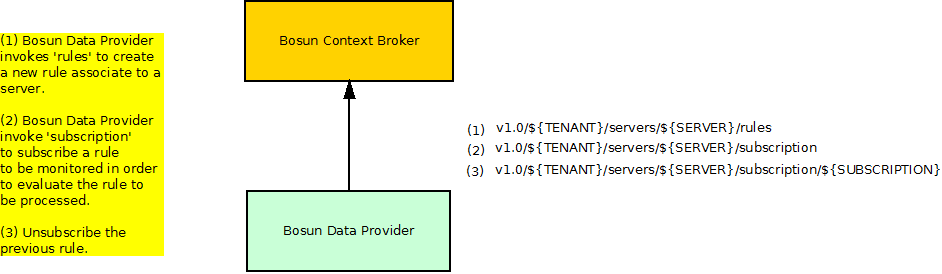
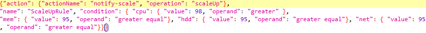
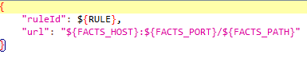
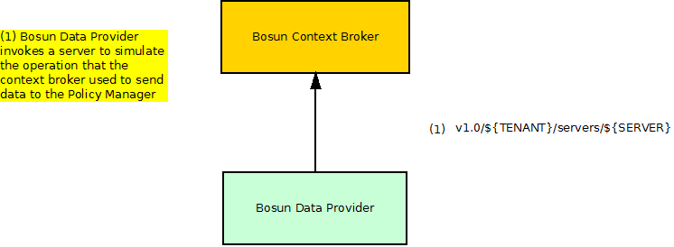
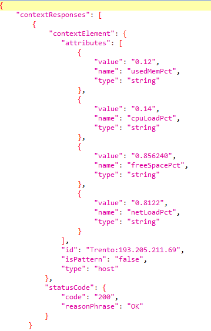

# Bosun: test cases description #

The scenarios defined for stress testing are taken from the most used operations of Bosun (It's two components cloto and facts) which correspond to the API methods that generate the next actions:

- `Rules`
- `Subscriptions` 
- `Facts sending`.

## Test Case 1.- Stress Scenario 1 – High Security, Debug log ##

The goal of this scenario is to assess system performance with a high load in a short period of time, with the Security Level parameter configured to “High” (checking the authentication token generated by Openstack’s Keystone in each request)and the log file to “debug”. To configure the security and log levels we should edit the file 'fiware-cloto.cfg '.

In the involved dataflow, as depicted by the picture above, are expected 2 main actors which are played respectively by the hosts shown in the following table:

| Actor | SW Involved | VM Host | Role |
|-------|:------------|:--------|:-----|
| Bosun Data provider | JMeter | Tester machine | Injects load to the component |
| Bosun component | Bosun | Hosting machine 1 | Subject of the test |

There are three types of requests in this script. The first one creates a rule, then a subscription to that rule is done and finally we unsubscribe the previous rule.We add one thread every four seconds to reach 300 and the scenario’s duration is 40 minutes

|ID	| GE API method	| Operation	| Type	| Payload	| Max. Concurrent Threads |
|---|:--------------|:----------|:------|:----------|:------------------------|
| 1 |	v1.0/\${TENANT}/servers/${SERVER}/rules |  Rule creation	| POST	|  | 300 |
| 2 |	v1.0/\${TENANT}/servers/${SERVER}/subscription | Create Subscription | POST |  |300 |
| 3 |	v1.0/\${TENANT}/servers/${SERVER}/subscription/${SUBSCRIPTION} |	Unsubscribe Subscription | POST |  | 300 |

Regarding the variables

- **TENANT**: It's a value previously created in the OpenStack Keystone.
- **SERVER**: The used server
- **SUBSCRIPTION**: Id of the subscription.

## Test Case 2.- Stress Scenario 2 – Low Security, Info log ##

It's analogous to the test case 1. The only difference is that this time the Security level parameter has been configured to “low”, and the log file to “info”.

## Test Case 3.- Stability Scenario ##

The goal of this scenario is to check if the system is degraded with a moderate load for a long period of time. This case is analogous to test case 2 the difference is that it's stability test not a stress one.

The test adds one thread every ten seconds to reach 30 and lasts 6 hours. 

Actors and requests are the same than in the first test case so it's not needed to explain them again.

## Test Case 4.- Facts Stress Scenario ##

Stress scenario, similar to the test cases 1 and 2, but this time, a fact is sent to the Facts component.

The actors that are involved are the same than the ones that have been used during all the cases.

There is just one type of request that simulatse the operation that the context broker used to send data to the Policy Manager 

|ID	| GE API method	| Operation	| Type	| Payload	| Max. Concurrent Threads |
|---|:--------------|:----------|:------|:----------|:------------------------|
| 1 |	v1.0/${TENANT}/servers/${SERVER} |  Fact sending	| POST	|  | 300 |

The variables are explained in the first test case.

## Test Case 5.- Facts Stability Scenario ##

This scenario is similar to the test case 3, but using the same facts scenario than in the test case 4.

The test adds one thread every 60 seconds to reach 30 and lasts 6 hours. 
