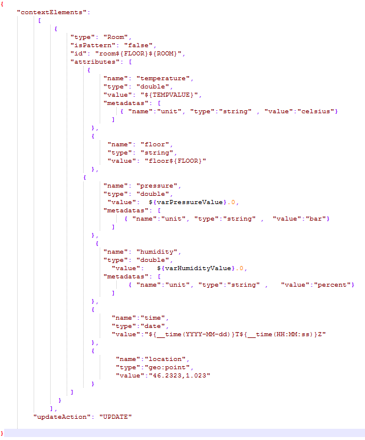
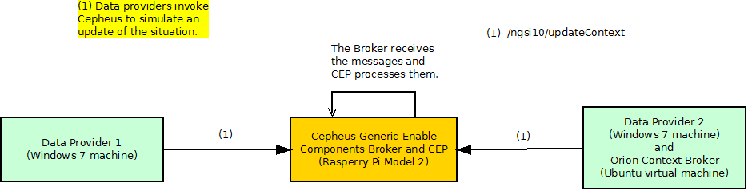
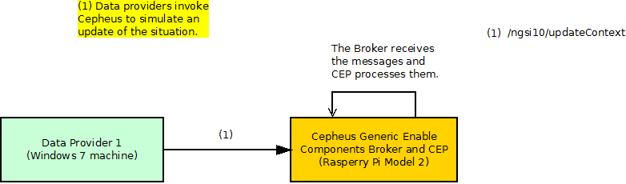

# Cepheus: test cases description #

The scenarios defined for stress testing are taken from the most used operations of Cepheus which correspond to the API methods that generate the next actions:

- updateContext (sent to Cepheus-CEP) (First case)
- updateContext (sent to Cepheus-Broker) (The rest of them)

Cepheus has a complex architecture. It has two main components CEP and Broker that realises two different functions. This could be an overview of its architecture.

## Test Case 1.- CEP Stress Scenario ##

The goal of this scenario is to assess system performance when sending the requests directly to CEP with a high load. Here, we can see an example of the used architecture.

In the involved dataflow, as depicted by the picture below, are expected 2 main actors which are played respectively by the hosts shown in the following table:

| Actor | SW Involved | VM Host | Role |
|-------|:------------|:--------|:-----|
| Cepheus Data provider (2 Windows7 machines) | JMeter | Tester machine | Injects load to the component |
| Cepheus component | Cepheus | Hosting machine 1 | Subject of the test |

There is just one type of request in this script. This request updates the current situation. An example would be a washing machine that sends every minute its situation (Washing up). We add 10 threads every 9 seconds until reaching 2000 and the scenario’s duration is 45 minutes.

|ID	| GE API method	| Operation	| Type	| Payload	| Max. Concurrent Threads |
|---|:--------------|:----------|:------|:----------|:------------------------|
| 1 |	/ngsi10/updateContext |  Update	| POST	|  | 2000 (10 seconds pause between requests) |

Regarding the variables

- **FLOOR**: Random number between 0 and 49.
- **ROOM**: Random number between 1 and 20
- **TEMPVALUE**: Random number betweem 10 and 42.
- **varPressureValue**: Random number between 990 and 1030.
- **varHumidityValue**: Random number between 10 and 100.

## Test Case 2.- Broker Stress Scenario ##

The goal of this scenario is to assess system performance when sending the requests directly to Broker with a high load. Here, we can see an example of the used architecture.

In the involved dataflow, as depicted by the picture below, are expected 2 main actors which are played respectively by the hosts shown in the following table:

| Actor | SW Involved | VM Host | Role |
|-------|:------------|:--------|:-----|
| Cepheus Data provider (2 Windows7 machines) | JMeter | Tester machine | Injects load to the component |
| Cepheus component (Broker and CEP)| Cepheus | Hosting machine 1 | Subject of the test |

The difference between this test case and the first one is that in this case the requests are sent to Cepheus Broker instead of sending them directly to CEP. The features of the JMeter's script are the same than in the first test case.

## Test Case 3.- Load Scenario ##

The goal of this scenario is to check if the system is able to satisfy the performance requirements given by the GE’s owner.

This test case is analogous to the second one but with different load and duration. It tries to match with the performance requirementes provided by the GE's owner.  To inject the load we use again twp Windows7 machines.

|ID	| GE API method	| Operation	| Type	| Payload	| Max. Concurrent Threads |
|---|:--------------|:----------|:------|:----------|:------------------------|
| 1 |	/ngsi10/updateContext |  Update	| POST	|  | 1000 (10 seconds pause between requests) |

As can be observed the number of threads is just half than in the previous case. (1000 threads)

## Test Case 4.- Stability Scenario ##

The goal of this scenario is to check if the system is degraded with a moderate load for a long period of time.

The main difference is that in this case we've just used one data provider

| Actor | SW Involved | VM Host | Role |
|-------|:------------|:--------|:-----|
| Cepheus Data provider (1 Windows7 machines) | JMeter | Tester machine | Injects load to the component |
| Cepheus component (Broker and CEP)| Cepheus | Hosting machine 1 | Subject of the test |

We have used again the same script, sending the requests to Cepheus Broker, with a moderate load, and a high duration.

In this case we add 3 threads every 4 seconds until reaching 450 users.

|ID	| GE API method	| Operation	| Type	| Payload	| Max. Concurrent Threads |
|---|:--------------|:----------|:------|:----------|:------------------------|
| 1 |	/ngsi10/updateContext |  Update	| POST	|  | 450 (10 seconds pause between requests) |