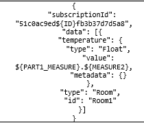

# Cygnus: test cases description #

The scenarios defined for stress and stability testing are taken as example of a request simulating Orion.

- `Cygnus Stress`
- `Cygnus Stability` 

## Test Case 1. – Cygnus Stress ##

The goal of this scenario is to assess system performance with a high load in a short period of time. The test consists in to simulate the Orion behavior sending requests to the Cygnus system to be processed.

The requests have some parameters which are randomly configured in time and are send as part of the payload.

Respect to the load in this scenario, we add one thread every 6 seconds until reach 111 users (the real number of users should be 200, but caused by errors during the load, the maximum users reached were 111). The test is running a total of 25 minutes.

|ID	| GE API method	| Operation	| Type	| Payload	| Max. Concurrent Threads |
|---|:--------------|:----------|:------|:----------|:------------------------|
| 1 | /v2/notify | Notification | POST |  | 111 |

Regarding the variables

Mainly, only the host must be configured to run the notification requests.

## Test Case 2. – Cygnus Stability ##

It's analogous to the test case 1. The only difference is the load for the execution. In this case we run 1 thread every 6 seconds until reach 100 users. Finally, the total duration of test is 6 hours.