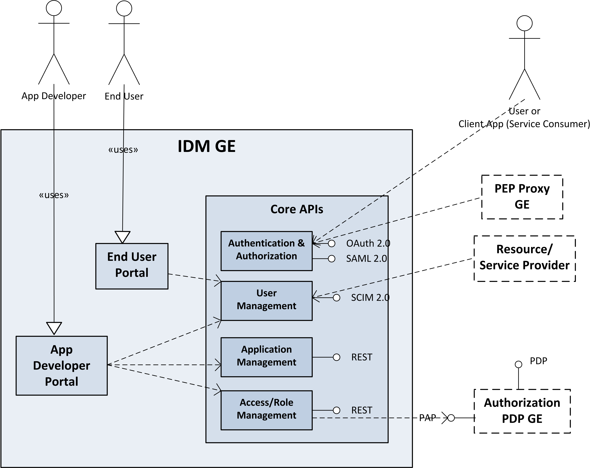
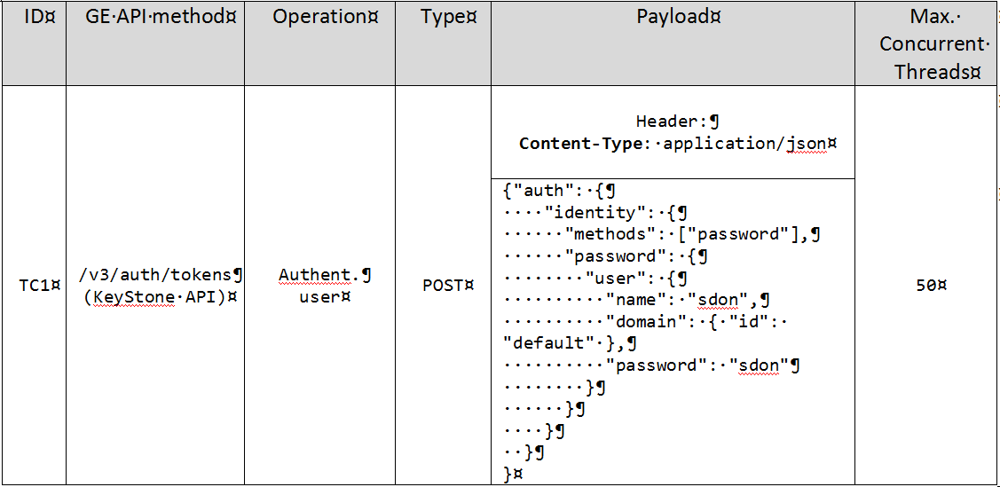
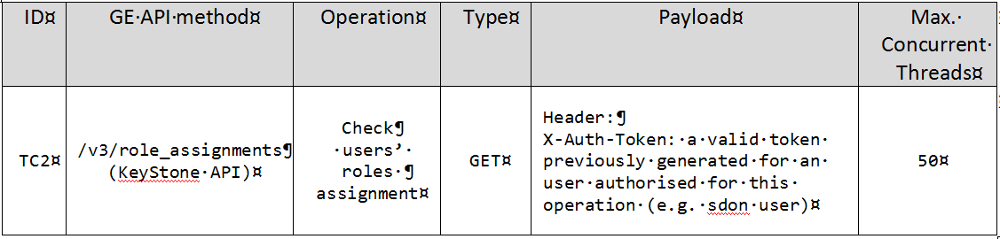
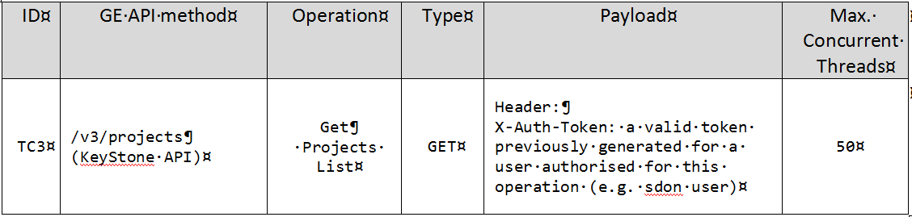
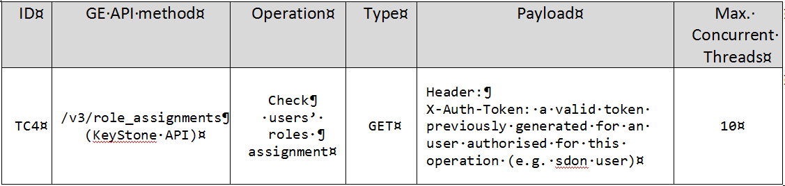

# Keyrock: test cases description #

The scenarios defined for stress testing are taken from the most used KeyRock APIs which correspond to the following operations:

- `User authentication`
- `Check roles assignment`
- `Get projects assignment`

The picture below, that is taken from the GE official documentation, summarises the general structure of a FIWARE IdM GE:

## User authentication test case ##

This test aims to stress the authentication API in order to get a valid token; therefore a valid couple of user and password (already configured in KeyRock) is needed to complete this operation.

The main actors involved by this scenario, which are among those showed previously in the general structure of the FIWARE IdM GE, are:

- `User`
- `IdM GE - Authentication & Authorization`

The actor `User` is represented by the **JMeter** application installed on a server and configured to send `user authentication` requests to **KeyRock** (an example of this type of request is shown in the table below).

The actor `IdM GE - Authentication & Authorization` is  represented by the **KeyRock** module in charge of fulfilling the aforementioned requests.

Three main steps can be identified in this test, which are:

1. JMeter sends a user authentication request.
2. Keyrock receives and verifies the authentication request.
3. KeyRock once verified the incoming request sends a positive (HTTP code 200) or negative response (HTTP code 401) to JMeter as the case; if positive, KeyRock response contains also a valid token in the header. 

For this test JMeter has to be configured with a growing number threads (max 50) which continuosly solicit the KeyRock authentication API for a period of 30 minutes.

An example of the payload contained by these requests can be found in the table below:

##Check roles assignment test case	##

This test aims to stress the "check roles assignment" operation. A valid token previously obtained through the user authentication API is needed to complete this operation.

The main actors involved by this scenario, which are among those showed previously in the general structure of the FIWARE IdM GE, are:

- `User`
- `IdM GE - Authentication & Authorization`

The actor `User` is represented by the **JMeter** application installed on a server and configured to send `check user role` requests to **KeyRock** 
(an example of this type of request is shown in the table below).

The actor `IdM GE - Authentication & Authorization` which is the **KeyRock** module in charge of fulfilling the aforementioned requests.

Three main steps can be identified in this test, which are:

1. JMeter sends a "check user role" request.
2. Keyrock receives and verifies the authentication request.
3. KeyRock once verified the incoming request sends a positive (HTTP code 200) or negative response (HTTP code 401) to JMeter as the case; 

For this test, JMeter,as in the previous one, has to be configured with a growing number threads (max 50) which continuosly solicit the KeyRock "check user role" API for a period of 30 minutes.
An example of the payload contained by these requests can be found in the table below:

##Get projects assignment test case##

This test aims to stress the "get project" operation. A valid token previously obtained through the user authentication API is needed to complete this operation.

The main actors involved by this scenario, which are among those showed previously in the general structure of the FIWARE IdM GE, are:

- `User`
- `IdM GE - Authentication & Authorization`

The actor `User` is represented by the **JMeter** application installed on a server and configured to send `get project list` requests to **KeyRock** (an example of this type of request is shown in the table below).
The actor `IdM GE - Authentication & Authorization` which is the **KeyRock** module in charge of fulfilling the aforementioned requests.

Three main steps can be identified in this test, which are:

1. JMeter sends a "Get projects" request.
2. Keyrock receives and verifies the authentication request.
3. KeyRock once verified the incoming request sends a positive (HTTP code 200) or negative response (HTTP code 401) to JMeter as the case; 

For this test, JMeter, as in the previous one, has to be configured with a growing number threads (max 50) which continuosly solicit the KeyRock "Get projects" API for a period of 30 minutes.
An example of the payload contained by these requests can be found in the table below:

##Check roles assignment test case	- stability test##

This test aims to test the stability of the "Check roles" authorisation operation. A valid token obtained through the user authentication API is needed to complete this operation.

The main actors involved by this scenario, which are among those showed previously in the general structure of the FIWARE IdM GE, are: 

- `User`
- `IdM GE - Authentication & Authorization`

The actor `User` is represented by the **JMeter** application installed on a server and configured to send `check user role` requests to **KeyRock** (an example of this type of request is shown in the table below).
The actor `IdM GE - Authentication & Authorization` which is the **KeyRock** module in charge of fulfilling the aforementioned requests.

Three main steps can be identified in this test, which are:

1. JMeter sends a "Check roles" request.
2. Keyrock receives and verifies the authoristation request.
3. KeyRock once verified the incoming request sends a positive (HTTP code 200) or negative response (HTTP code 401) to JMeter as the case; 

For this test, JMeter has to be configured with 10 threads which will solicit KeyRock uninterruptedly for 8 hours using this authorisation API.

An example of the payload contained by these requests can be found in the table below:
