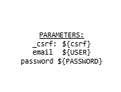
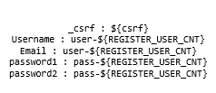

# Identity Manager Keyrock: test cases description #

The scenarios defined for testing are taken as example of a data written to database, querying and deletion.

- `Authentication Stress`
- `Create user Stress`
- `Get administrator Stress`
- `Combined Stability`

There are different types of requests in this script: Creation of users, Login and Get administrators.

## Test Case 1.- Authentication Stress Scenario ##

The goal of this scenario is to assert system performance with a high load in a short period of time. In this case we check the Authentication service. 

We add two threads every 6 seconds to reach 200 and the scenario’s duration is 25 minutes

|ID	| GE API method	| Operation	| Type	| Payload	| Max. Concurrent Threads |
|---|:--------------|:----------|:------|:----------|:------------------------|
|1  | /auth/login/ | Authentication | POST |  | 200 |

Regarding the variables

- **HOST** -> IP or hostname of the host where Keyrock is deployed.
- **PORT** -> Port where Keyrock is listening.
- **USER** -> Username to login.
- **PASSWORD** -> Password of the previous username.

## Test Case 2.- Creation Stress Scenario ##

The goal of this scenario is to assert system performance with a high load in a short period of time. In this case we check the Creation service. 

We add two threads every 6 seconds to reach 200 and the scenario’s duration is 25 minutes

|ID	| GE API method	| Operation	| Type	| Payload	| Max. Concurrent Threads |
|---|:--------------|:----------|:------|:----------|:------------------------|
|1  | /sign_up | Create User | POST |  | 200 |

Regarding the variables

- **HOST** -> IP or hostname of the host where Keyrock is deployed.
- **PORT** -> Port where Keyrock is listening.
- **DB_HOST** -> The host where DB is allocated.
- **DB_PORT** -> The port where DB is listening.
- **DB_USER** -> Username in database who can manage keyrock instance.
- **DB_PASSWORD** -> Password for the previous username.
- **REGISTER_USER_CNT** -> Counter for using as index of registered email accounts.

## Test Case 3.- Get Administrators Stress Scenario ##

The goal of this scenario is to assert system performance with a high load in a short period of time. In this case we check the Get Administrator service. 

We add two threads every 6 seconds to reach 200 and the scenario’s duration is 25 minutes

|ID	| GE API method	| Operation	| Type	| Payload	| Max. Concurrent Threads |
|---|:--------------|:----------|:------|:----------|:------------------------|
|1  | /idm/admins/users | Get Administrators | GET | N/A | 200 |

Regarding the variables

- **HOST**	-> IP or hostname of the host where Keyrock is deployed.
- **PORT**	-> Port where Keyrock is listening.
- **USER**	-> Administrator account.
- **PASSWORD**	-> Password of administrator account.
- **GETUSERS_USER_CNT**	-> Counter for using as index of registered email accounts.

## Test Case 4.- Combined Stability Scenario ##

It's the union of the three previous cases: First of all, Create user, Authentication and Getting Administrators.

The only difference is the load and time set. In this case, we set:
10 users for Registering who will be up in 60 seconds.
30 users for Authentication who will be up in 180 seconds.
10 users for Getting Administrators who will be up in 60 seconds.

All of them will be executed for 6 hours.
