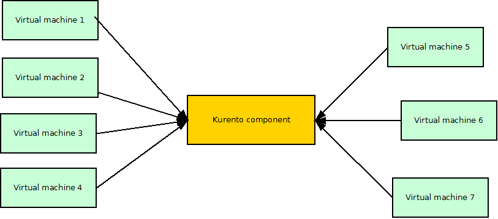
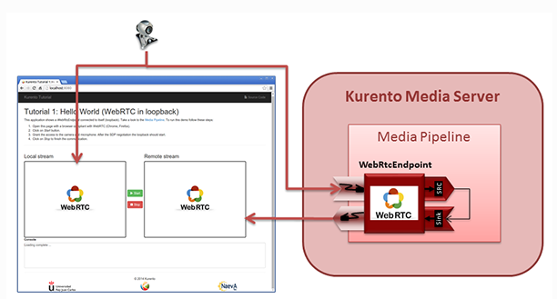

# Kurento: test cases description #

There has been contemplated only a Loopback scenario. For the execution of the tests it was configured a test environment consists of one physical machine for the deployment of Kurento server and 7 virtual machines to inject load. To simulate loading and monitoring Kurento server, has been developed a software adhoc wherein Selenium WebDriver has been used.

## Test Cases 1.- Loopback’s Stress Scenario ##

Stress scenario, where it has been added a virtual user every minute to reach 90 running a loopback scenario in Chrome Browser. The scenario stops when the 90 concurrent users are reached. The goal of this scenario is to assess Kurento server’s behavior in high load situations.

For the execution of the tests it was configured a test environment consists of one physical machine for the deployment of Kurento server and 7 virtual machines to inject load. To simulate loading and monitoring Kurento server, has been developed a software adhoc wherein Selenium WebDriver has been used.

In the involved dataflow, as depicted by the picture above, are expected 2 main actors. Virtual machines are the responsibles for providing data to the tested component.
There is also a physical machine where kurento is deployed.

| Actor | SW Involved | VM Host | Role |
|-------|:------------|:--------|:-----|
| Kurento Data providers | Selenium script | Tester machine | Injects load to the component |
| Kurento component | Kurento | Physical machine | Subject of the test |

It's a Loopback scenario. The client sends via browser (Google Chrome) his webcam signal. Then Kurento receives the data, and send it back to the client. For this scenario, it has been used up to 90 simultaneous virtual users.

|ID	| GE API method	| Operation	| Type	| Payload	| Max. Concurrent Threads |
|---|:--------------|:----------|:------|:----------|:------------------------|
| 1 |	Loopback |  Loopback	| 	|   | 90 |
