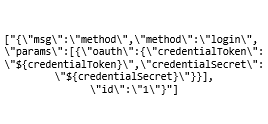

# Meteor APInf: test cases description #

The scenarios defined for stress and stability testing are taken as example of a request to a OAuth login through Identity Keyrock.

- `Meteor APInf Authentication Stress`
- `Meteor APInf Authentication Stability` 

## Test Case 1. – Meteor APInf Authentication Stress ##

The goal of this scenario is to assess system performance with a high load in a short period of time. The test consists in to use Identity Keyrock module as OAuth system to login into Meteor APInf.

Meteor APInf brings an example of "Simple to-do list" where you can write entries when you are logged previously. So, the first time you access and try to log in, the system communicates with Keyrock. When you type your valid credentials, Keyrock grants your session and returns to Meteor APInf application.

The test, in the first place, goes to the home page of Meteor APInf, then login into the system through Keyrock, returns to Meteor APInf, and finally log out of the system. The same process is repeated into the stability scenario, but with a different load.

Respect the load in this scenario, we add one thread every 6 seconds until reach 200 users. The test is running a total of 25 minutes.

|ID	| GE API method	| Operation	| Type	| Payload	| Max. Concurrent Threads |
|---|:--------------|:----------|:------|:----------|:------------------------|
| 1 | /sockjs/453/sonpct8v/xhr_send |  Authentication	| POST |  | 200 |

Regarding the variables

- **HOST** -> IP or hostname of the host where Meteor APInf is deployed.
- **PORT** -> Port where Meteor APInf is listening.
- **PORT_IDM** -> Port where Identity Keyrock is listening.

## Test Case 2. – Meteor APInf Authentication Stability ##

It's analogous to the test case 1. The only difference is the load for the execution. In this case we run 1 thread every 6 seconds until reach 20 users. Finally, the total duration of test is 6 hours.