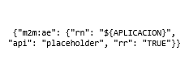
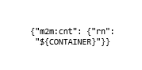
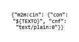

# OpenMTC: test cases description #

The are different scenarios defined for stress and stability testing.

The first one is a stress scenario with up to 200 threads creating an application, with 25 minutes duration. The second, third and four ones are analogous, but creating containers, creating texts or getting the latest text from a container.
The last one is a stability scenario with 5 threads for each test case and 6 hours duration.

- `Application creation stress scenario`
- `Container creation stress scenario`
- `Text creation stress scenario`
- `Get text stress scenario`
- `Combined stability scenario`

## Test Case 1. – Application creation stress ##

Stress scenario, where a user is added every six seconds until reach 200 (after 20 minutes), sending an application creation request in loop mode.
After reaching 200 users, the test runs for five more minutes until the users stop simultaneously

|ID	| GE API method	| Operation	| Type	| Payload	| Max. Concurrent Threads |
|---|:--------------|:----------|:------|:----------|:------------------------|
| 1 | /onem2m/ | APP creation | POST |  | 200 |

Regarding the variables, some of them are automatically generated in runtime.

- **HOST** -> Host/IP where OpenMTC is desployed.
- **PORT** -> Port in Host where OpenMTC is listening.
- **THREADS** -> Number of threads to run during test.
- **RAMP** -> Time during threads are launched.
- **APLICACION** -> Randomly generated name to be sent in the request.
- **CONTAINER** -> Randomly generated name to be sent in the request.
- **TEXT** -> Randomly generated name to be sent in the request.

## Test Case 2. – Container creation stress ##

It's analogous to the test case 1, but this time the request creates a container instead an application. The load of test is the same too.

|ID	| GE API method	| Operation	| Type	| Payload	| Max. Concurrent Threads |
|---|:--------------|:----------|:------|:----------|:------------------------|
| 1 | /onem2m/${APLICACION}/ | Container creation | POST |  | 200 |

## Test Case 3. – Text creation stress ##

It's analogous to the test case 1, but this time the request creates a text instead an application. The load of test is the same too.

|ID	| GE API method	| Operation	| Type	| Payload	| Max. Concurrent Threads |
|---|:--------------|:----------|:------|:----------|:------------------------|
| 1 | /onem2m/${APLICACION}/${CONTAINER}/ | Create Text | POST |  | 200 |

## Test Case 4. – Get text stress ##

It's analogous to the test case 1, but this time the request the last created text instead to create an application. The load of test is the same too.

|ID	| GE API method	| Operation	| Type	| Payload	| Max. Concurrent Threads |
|---|:--------------|:----------|:------|:----------|:------------------------|
| 1 | /onem2m/${APLICACION}/${CONTAINER}/latest | Get Text | GET | N/A | 200 |

## Test Case 5. – Combined stability ##

Using the previous four test cases, we compound a stability scenario which has 6 hours duration. 5 simultaneous threads were executing each test case (20 threads in total). 

|ID	| GE API method	| Operation	| Type	| Payload	| Max. Concurrent Threads |
|---|:--------------|:----------|:------|:----------|:------------------------|
| 1 | /onem2m/ | APP creation | POST |  | 200 |
| 2 | /onem2m/${APLICACION}/ | Container creation | POST |  | 200 |
| 3 | /onem2m/${APLICACION}/${CONTAINER}/ | Create Text | POST |  | 200 |
| 4 | /onem2m/${APLICACION}/${CONTAINER}/latest | Get Text | GET | N/A | 200 |

