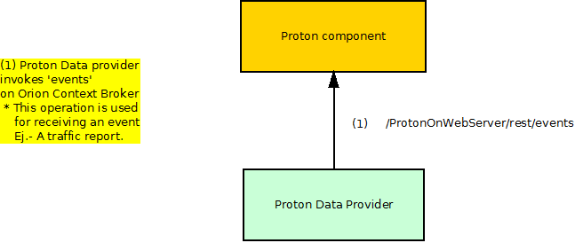
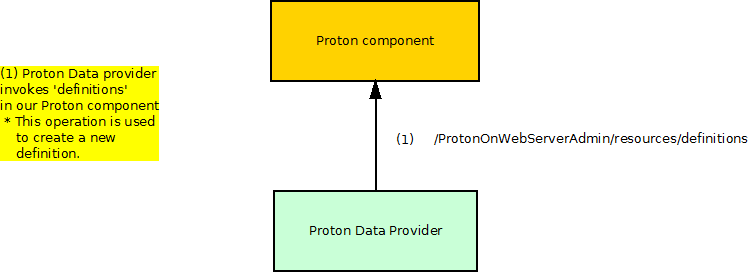
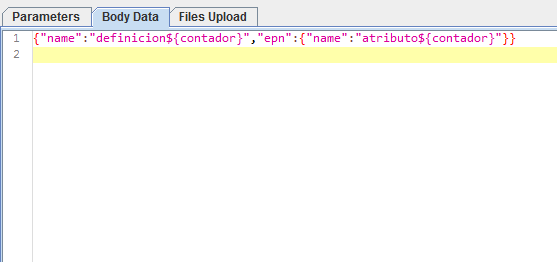
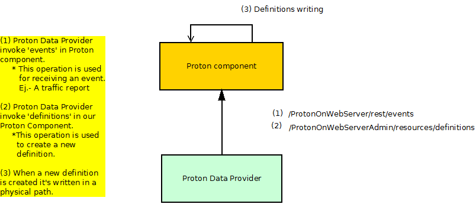

# Proton: test cases description #

The scenarios defined for stress testing are taken from the most used operations of Proton which correspond to the API methods that generate the next actions:

- `Event`
- `Definition` 
- `NGSlv2 Update`.

## Test Cases 1.- Event Stress scenario ##

The goal of this scenario is to assess Events service performance. For this scenario, Unit Test 1 defined in Proton's documentation (https://forge.fiware.org/plugins/mediawiki/wiki/fiware/index.php/CEP_GE_-_IBM_Proactive_Technology_Online_Unit_Testing_Plan) has been used.
The definition used is the one in Unit Test 1 (DoSAttack project definition). The script sends a Traffic Report's event every 200ms for each thread. If the conditions defined are reached (TR3.volume>1.50* TR2.volume AND TR2.volume>1.50 * TR1.volume), then an ExpectedCrash event is thrown.

In the involved dataflow, as depicted by the picture above, are expected 2 main actors. The 'Proton Data Provider' is the responsible for providing data to the tested component. It consists of a machine where JMeter is placed and where we launch some scripts whose requests are formed with some JSON examples. 
The second machine, where Proton is placed, consists of a Tomcat(that must be up an running) where Proton is deployed. The following table is a summary of the actors and SW that are involved.

| Actor | SW Involved | VM Host | Role |
|-------|:------------|:--------|:-----|
| Proton Data provider | JMeter | Tester machine | Injects load to the component |
| Proton component | Proton deployed in a tomcat | Hosting machine 1 | Subject of the test |

The 'Sending event' request consists of a HTTP request whose content-type is test/plain and whose body is as follow: 'Name=TrafficReport;volume=${volumen};'. The maximum number of threads is 200.

|ID	| GE API method	| Operation	| Type	| Payload	| Max. Concurrent Threads |
|---|:--------------|:----------|:------|:----------|:------------------------|
| 1 |	/ProtonOnWebServer/rest/events |  Event	| POST	| Name=TrafficReport;volume=${volumen}; | 200 |

The variable volume is a random number with this format '0000'.

## Test Case 2.- Create Definitions Stress Scenario ##

It's a simple definitions creation script. 

The actors involved in this case are the same ones than in the last scenario.

The 'Definition event' request consists of a HTTP request whose content-type is 'application/json' and whose body is as follow: {"name":"definicion\${contador}","epn":{"name":"atributo${contador}"}}. The maximum number of threads that reaches the test is 200.

|ID	| GE API method	| Operation	| Type	| Payload	| Max. Concurrent Threads |
|---|:--------------|:----------|:------|:----------|:------------------------|
| 1 |	/ProtonOnWebServerAdmin/resources/definitions |	Create Definition | POST |  |200 |

The variable "contador" is just a random number.

## Test Case 3.- Combined Stability Scenario ##

Using both of the stress scripts, a stability scenario (duration of 6 hours) has been run. 30 simultaneous threads were been sending Traffic Report's events every 200ms, and 3 threads creating new definitions every 200ms too. 

The actors involved in this case are the same ones than in the last scenario.

As have been explained before we mix the requests that are thrown to our Proton Component. 

|ID	| GE API method	| Operation	| Type	| Payload	| Max. Concurrent Threads |
|---|:--------------|:----------|:------|:----------|:------------------------|
| 1 |	/ProtonOnWebServer/rest/events |  Event	| POST	| Name=TrafficReport;volume=${volumen}; | 200 |
| 1 |	/ProtonOnWebServerAdmin/resources/definitions |	Create Definition | POST |  |200 |

The value of the diverse variables is obtained like we have explained in the previous tests.