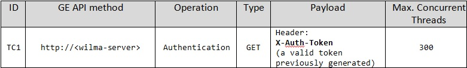
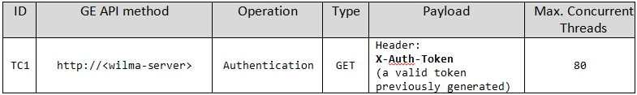

# Wilma PEP Proxy: test cases description #

The PEP Proxy GE Wilma is a backend component that checks **authentication** and **authorization** of users in **FIWARE applications**.

It is designed to perform **three levels of security** for the backend REST APIs. Requests to proxy are made with a special HTTP Header: X-Auth-Token. 
This header contains the OAuth access token obtained from FIWARE IdM GE. 
In order to validate the request and forward it to the backend application, PEP Proxy checks with Identity Management (IdM) and Authorization PDP GEs different parameters depending on the security level configured.
This obviously implies that **Wilma GE**, in order to work properly, **needs to be integrated with at least another GE component, the IdM KeyRock**, as well as with other GEs (for Authorization) depending on the aforementioned security levels, which are:

- Level 1: **Authentication** PEP Proxy checks if the token included in the request corresponds to an authenticated user in FIWARE.

- Level 2: Basic Authorization PEP Proxy checks if the token included in the request corresponds to an authenticated user in FIWARE but also if the roles that the user has allow it to access the resource specified in the request. This is based in the HTTP verb and the path. (It requires integration also with AuthZForce GE)

- Level 3: Advanced Authorization PEP Proxy checks if the token included in the request corresponds to an authenticated user in FIWARE but also other advanced parameters such us the body or the headers of the request. (It requires integration also with AuthZForce GE)

The tests described in this document are focused on the first of these levels of which performance and stability are assessed.

## Authentication stress test case ##

With this test case the authentication APIs is solicited for 40 minutes in order to assess its performance and reliability. During this test the system behavior is monitored with a growing input workload, as well as with a stable input workload, therefore the test is organized in two parts. 
In the first  one (for the first 30 minutes), the number of concurrent threads, through which many users sending a flood of requests are simulated, is variable and incremental: the test starts with 1 running thread and after 30 minutes of execution 300 running threads are reached.
On the other hand, during the second half, the number of concurrent requests is expected to be steady with 300 running threads.
It must be taken into account that this test expects a valid token already generated in order to be executed.

The following table sums up main infos of this test.

## Authentication stability test case ##

This test case aims to verify the stability and reliability of the system solicited with a not too demanding input workload; therefore the test is executed for 8 hours with a fixed number of concurrent requests (originated by 80 running threads which simulate as many users) in order to maintain a stable and light workload.
As for the previous test case, it must be taken into account that this one expects a valid token already generated in order to be executed.

The following table sums up main infos of this test.

