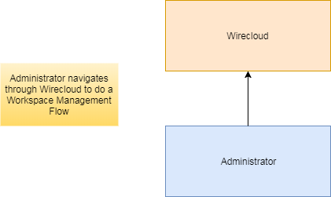
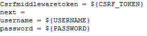
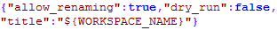
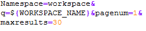
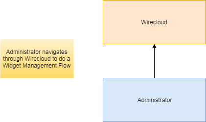
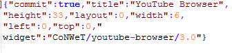
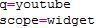
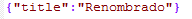

# Wirecloud: test cases description #

The scenarios defined for stress testing are taken from the most used operations of Wirecloud.

## Test Case 1.- Stress Scenario 1 – Workspaces management ##

Stress scenario, where a user is added every five seconds to reach 300 (after 25 minutes), doing these transactions:
-	Login
-	Creation of a new workspace
-	Searching of the created workspace
-	Deletion of the created workspace
-	Logout
After reaching 300 users, the test runs for five more minutes until the users stop simultaneously.

In the involved dataflow, as depicted by the picture above, are expected 2 main actors which are played respectively by the hosts shown in the following table:

| Actor | SW Involved | VM Host | Role |
|-------|:------------|:--------|:-----|
| Wirecloud Administrator | JMeter | Tester machine | Injects load to the component |
| Wirecloud component | Wirecloud and Tomcat | Hosting machine 1 | Subject of the test |

There are two types of requests in this script. The first one creates a domain and, after that, the domain is deleted. We add one thread every five seconds to reach 200 and the scenario’s duration is 25 minutes

|ID	| GE API method	| Operation	| Type	| Payload	| Max. Concurrent Threads |
|---|:--------------|:----------|:------|:----------|:------------------------|
| 1 |	/login |  Login	| POST	|  | 300 |
| 2 |	/api/workspaces | Create Workspace | POST |  | - |
| 3 |	/api/search |  Workspace Search	| GET	|  | - |
| 4 |	/api/workspace/${WORKSPACE_ID} | Delete Workspace | DELETE |  | - |
| 5 |	/logout |  Logout	| GET	|  | - |

Regarding the variables

- **CSRF_TOKEN**: CSRF Token used in login.
- **USERNAME**: Username used in the login.
- **PASSWORD**: Password for the username.
- **WORKSPACE_NAME**: The name of workspace created, used in the search.
- **WORKSPACE_ID**: The workspace created and the one which is going to be deleted.

## Test Case 2.- Stress Scenario 2 – Widgets management ##

Stress scenario, where a user is added every five seconds to reach 300 (after 25 minutes), doing these transactions:

-	Login
-	Searching of a workspace
-	Selection of the searched workspace
-	Adding a widget to the selected workspace
-	Add wiring to the widget added
-	Renaming the wiring
-	Removing the added component
-	Logout

After reaching 300 users, the test runs for five more minutes until the users stop simultaneously.

As depicted by the picture above, 2 main actors are expected, which are played respectively by the hosts shown in the following table:

| Actor | SW Involved | VM Host | Role |
|-------|:------------|:--------|:-----|
| Wirecloud Authorization Requester | JMeter | Tester machine | Injects load to the component |
| Wirecloud component | Wirecloud and Tomcat | Hosting machine 1 | Subject of the test |

|ID	| GE API method	| Operation	| Type	| Payload	| Max. Concurrent Threads |
|---|:--------------|:----------|:------|:----------|:------------------------|
| 1 |	/login |  Login	| POST	|  | 300 |
| 2 |	/api/search |  Workspace Search	| GET	|  | - |
| 3 |	/api/workspace/${WORKSPACE_ID} | Select Workspace | GET | | - |
| 4 |	/api/workspace/${WORKSPACE_ID}/tab/${TAB_ID}/iwidgets | Add Workspace Component| POST |   | - |
| 5 |	/catalogue/resources | Add Wiring | GET |  |  |
| 6 |	/api/workspace/${WORKSPACE_ID}/tab/${TAB_ID}/iwidget/${COMPONENT_ID} |  Rename Wiring	| POST	|  | - |
| 7 |	/api/workspace/${WORKSPACE_ID}/tab/${TAB_ID}/iwidget/${COMPONENT_ID} | Remove Workspace Component | DELETE |  | - |
| 8 |	/logout |  Logout	| GET	|  | - |

Regarding the variables

- **CSRF_TOKEN**: CSRF Token used in login.
- **USERNAME**: Username used in the login.
- **PASSWORD**: Password for the username.
- **WORKSPACE_NAME**: The name of workspace created, used in the search.
- **WORKSPACE_ID**: The workspace created and the one which is going to be deleted.
- **TAB_ID**: The ID of the tab where the widget is going to be added.

## Test Case 3.- Stress Scenario 3 – Workspaces management ##

Analogous to the test case 1, but this time there is a constant wait time of a second after workspace creation, in order to minimize error due to trying to access to the workspace created before the creation finishes.

## Test Case 4.- Stress Scenario 4 – Workspaces management ##

Analogous to the test case 2, but this time there is a constant wait time of a second after each transaction, excepting login and logout, in order to minimize error due to trying to an element which execution is not finished yet.

## Test Case 5.- Stability Scenario ##

Using both of the stress scripts, a stability scenario (duration of 6 hours) has been run. 10 simultaneous threads were executing the test case 3, and another 10 the test case 4. 

Actors and requests are the same than in the first test case so it's not needed to explain them again.

